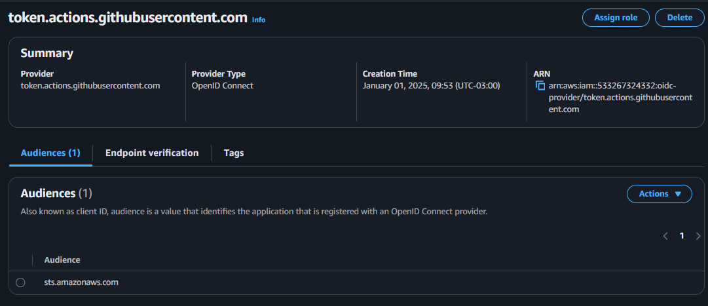
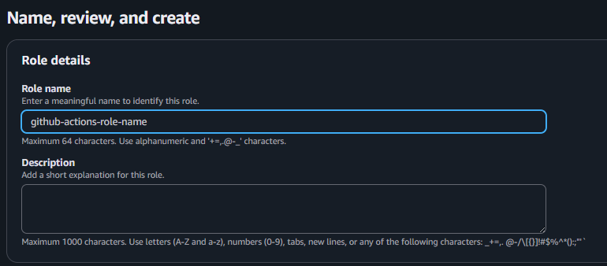
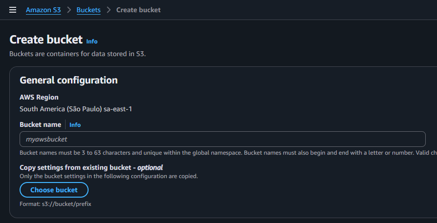
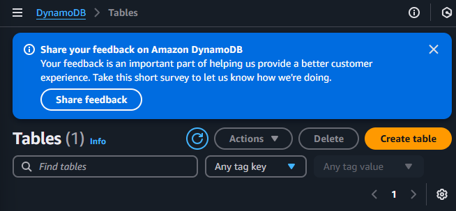

# terraform-infra-pipeline-aws


- criar um repoistório no github
- abrir o repositório em uma IDE
- criar diretório infra
- criar arquivo infra/main.tf

- criar arquivo infra/variables.tf

```bash
variable "bucket_name" {
  description = "The name of the S3 bucket to create."
  type        = string
  
}
```

- criar arquivo infra/provider.tf com o conteúdo:

```bash
provider "aws" {
  region = "sa-east-1"
}
```

- criar o arquivo infra/backend.tf
- indica onde o arquivo statefile será salvo
- parâmetros serão atualizados em tempo de pipeline
- criar os diretórios infra/envs/dev, infra/envs/hom infra/envs/prod
- criar o arquivo terraform.tfvars dentro de cada um dos diretórios com o conteúdo

```bash
bucket_name = "<env>-sa-east-1-buildrun-video-pipeline"
```


### Configurar Github actions e AWS

- https://aws.amazon.com/pt/blogs/security/use-iam-roles-to-connect-github-actions-to-actions-in-aws/

- Acessar a conta da AWS
- A conexão do github e aws será entre o OpenIdentity
- Acessar o IAM > Identity provider > Add provider
- Preencha:
-- Provider URL: `https://token.actions.githubusercontent.com`
-- Audience: `sts.amazonaws.com`
- Clique no provider recém criado:


- Quando a esteira executar, ela vai chamar a aws e ela vai passar algumas informações
- A AWS vai identificar que é uma pipeline segura e vai dar as permissões de acesso à pipeline

- Clique em `Assign role`


- Clique em `Create a new role`


- Selecione `Web identity`


- Preencha GitHub organization com o nome da sua conta do GitHub


- Selecionar as permissões que a esteira terá considerando a Boa prática de privilégio mínimo,
se precisar de mais permissões é só incluir
```
AmazonS3FullAccess
AmazonDynamoDBFullAccess
```


- Inserir o nome da role e clicar em `Create role`



- Criar o bucket para armazenar o statefile
- Acessar o serviço S3 > Create bucket > Atribuir o nome
- Habilitar o versionamento do bucker e clicar em `Create bucket`


- Criar uma tabele no DynamoDB para realizar o lock para modificações concorrentes
- Acessar o serviço DynamoDB > Create table



- Table name: <nome da conta do github>-sa-east-1-terraform-lock
- Partition key: `LockID` # precisa seguir essa sintaxe

- Clicar em `Create table`

