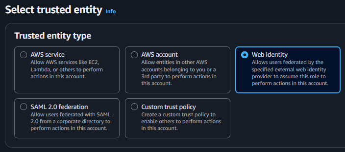
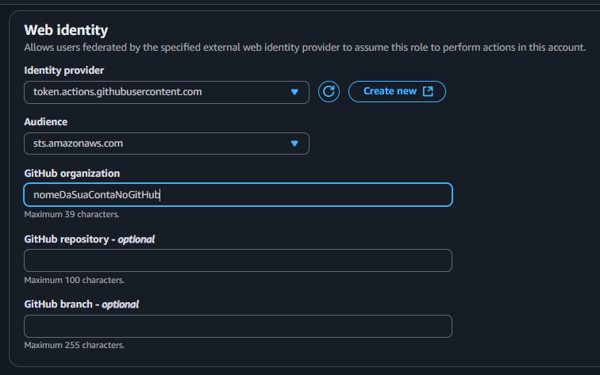
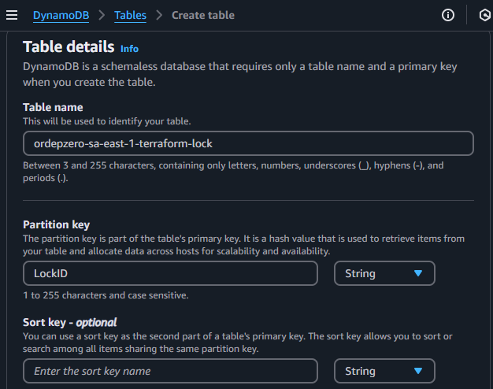

# Tech Challenge 2 (Fase 2): Pipeline Batch Bovespa: Ingestão e Arquitetura de dados


**Tech Challenge** é um projeto que reúne a aplicação dos conhecimentos adquiridos em todas as disciplinas de uma fase da Especialização em Machine Learning Engineering da FIAP PosTech.

Para o Tech Challenge 2, o desafio proposto foi o seguinte:

> 📢 **Problema:** construa um pipeline de dados completo para **Extrair, Processar e Analisar dados do pregão da B3 (IBovespa)**, utilizando AWS S3, Glue, Lambda e Athena. O link obrigatório para baixar os dados está disponível a seguir:

**Link do site:** [Carteira Teórica o IBovespa](https://sistemaswebb3-listados.b3.com.br/indexPage/day/IBOV?language=pt-br)

Para este desafio as entregas devem ser realizadas utilizando tecnologias da **Amazon Cloud** e atender aos seguintes **Requisitos/objetivos**:

• **Requisito 1:** realizar o scrap de dados do site da B3 (IBovespa), extraindo dados do pregão (dados brutos).

• **Requisito 2:** os dados brutos devem ser ingeridos no S3 em formato parquet com partição diária.

• **Requisito 3:** o Bucket S3 deve acionar uma Lambda, que por sua vez irá
chamar um job de ETL no Glue.

• **Requisito 4:** a Lambda pode ser em qualquer linguagem. Ela apenas
deverá iniciar o job Glue.

• **Requisito 5:** o job Glue deve ser feito no modo visual. Este job deve
conter as seguintes transformações obrigatórias:

5.a: Realizar agrupamento numérico, sumarização, contagem ou soma;

5.b: Renomear duas colunas existentes, além das colunas de agrupamento;

5.c: Realizar um cálculo com campos de data; por exemplo, poder ser duração, comparação ou diferença entre datas.

• **Requisito 6:** os dados refinados no job Glue devem ser salvos no formato parquet em uma pasta chamada REFINED, particionados por data
e pelo nome ou abreviação da ação do pregão.

• **Requisito 7:** o job Glue deve automaticamente catalogar o dado no
Glue Catalog e criar uma tabela no banco de dados default do Glue
Catalog.

• **Requisito 8:** os dados devem estar disponíveis e legíveis no Athena.

• **Requisito 9:** (OPCIONAL) construir um notebook no Athena para realizar
uma visualização gráfica dos dados ingeridos.

• **Requisito 10:** (OPCIONAL) construir uma Pipeline Stream Bitcoin, conforme arquitetura de referência fornecida.

## 📌 Objetivos

- Elaborar a **Arquitetura do projeto**, demonstrando todas as fases da pipeline;
- Implementar as tecnologias para o atendimento dos requisitos da Pipeline de Ingestão de Dados da B3;
- Documentar o projeto de forma a permitir a sua reprodução;
- Disponibilizar a documentação em um repositório no **GitHub**.

## Possíveis dores

- Falta de automação na obtenção dos dados bem como seu tratamento;
- Falta de padronização para acesso aos dados bem como tipos de retornos e formatos mais adequados para consumo na produção de consultas e analytics;
- Suporte e documentação insuficientes;
- Redundância de dados em histórico confiável, com fonte de dados própria;
- Baixa capacidade de análise em questões relevantes para o usuário final.

## Proposta de solução

Em face ao desafio proposto, algumas funcionalidades propostas (stages) para a Pipeline Batch Bovespa:

- Ingestão de dados: coleta automática de dados (webscraping) extraídos do site B3 (IBovespa), por meio de script em Lambda trigado pelo Event Bridge;
- Armazenamento de dados: salvamento em formato bruto (RAW), com partição diária, em Bucket S3;
- Processamento: limpeza, transformação e padronização, usando script em Glue acionado pela Lambda e trigado por Event Bridge;
- Carga final: gravação de dado procesado (REFINED), com partição diária, em Bucket S3;
- Agregações e Cálculos: agregações e cálculos, usando script em Glue, para análise do comportamento dos dados;
- Consumo: leitura dos dados refinados e agregados para a produção de relatórios e dashboards, usando Athena e Google Colab.


**Importante**

Toda a implementação foi feita via Terraform, portanto, com o princípio de **Infrastructure as a Code** e foi documentada neste repositório.


### 📂 Estrutura do projeto

(inserir)

### 🔩 Arquitetura da solução

A arquitetura da solução foi desenhada com base nos stages necessários ao atendimento de requisitos e consta na pasta de documentação deste repositório. [Link para o Diagrama](inserir figura e link)

## Documentação Terraform

```

# terraform-infra-pipeline-aws


- criar um repoistório no github
- abrir o repositório em uma IDE
- criar diretório infra
- criar arquivo infra/main.tf

- criar arquivo infra/variables.tf

```bash
variable "bucket_name" {
  description = "The name of the S3 bucket to create."
  type        = string
  
}
```

- criar arquivo infra/provider.tf com o conteúdo:

```bash
provider "aws" {
  region = "sa-east-1"
}
```
- criar o arquivo infra/backend.tf
- indica onde o arquivo statefile será salvo
- parâmetros serão atualizados em tempo de pipeline
- criar os diretórios infra/envs/dev, infra/envs/hom infra/envs/prod
- criar o arquivo terraform.tfvars dentro de cada um dos diretórios com o conteúdo

```bash
bucket_name = "<env>-sa-east-1-buildrun-video-pipeline"``

### Configurar Github actions e AWS

- https://aws.amazon.com/pt/blogs/security/use-iam-roles-to-connect-github-actions-to-actions-in-aws/

- Acessar a conta da AWS
- A conexão do github e aws será entre o OpenIdentity
- Acessar o IAM > Identity provider > Add provider
- Preencha:

  - Provider URL: `https://token.actions.githubusercontent.com`
  - Audience: `sts.amazonaws.com`
- Clique no provider recém criado:


- Quando a esteira executar, ela vai chamar a aws e ela vai passar algumas informações
- A AWS vai identificar que é uma pipeline segura e vai dar as permissões de acesso à pipeline

- Clique em `Assign role`


- Clique em `Create a new role`


- Selecione `Web identity`


- Preencha GitHub organization com o nome da sua conta do GitHub


- Selecionar as permissões que a esteira terá considerando a Boa prática de privilégio mínimo,
se precisar de mais permissões é só incluir
```
AmazonS3FullAccess
AmazonDynamoDBFullAccess
```


- Inserir o nome da role e clicar em `Create role`


- Criar o bucket para armazenar o statefile
- Acessar o serviço S3 > Create bucket > Atribuir o nome
- Habilitar o versionamento do bucker e clicar em `Create bucket`


- Criar uma tabele no DynamoDB para realizar o lock para modificações concorrentes
- Acessar o serviço DynamoDB > Create table


- Table name: <nome da conta do github>-sa-east-1-terraform-lock
- Partition key: `LockID` # precisa seguir essa sintaxe

- Clicar em `Create table`

Feito isso, criar o arquivo .github/workflows/terraform.yaml, .github/workflows/develop.yaml, .github/workflows/prod.yaml

## Vídeo de Apresentação no Youtube
Para melhor compreensão da entrega, foi produzido um vídeo de apresentação que foi publicado no Youtube:

[Link para a Vídeo](inserir link)


## ✒️ Autores

| Nome                            |   RM    | Link do GitHub                                      |
|---------------------------------|---------|-----------------------------------------------------|
| Ana Paula de Almeida            | 363602  | [GitHub](https://github.com/Ana9873P)               |
| Augusto do Nascimento Omena     | 363185  | [GitHub](https://github.com/AugustoOmena)           |
| Bruno Gabriel de Oliveira       | 361248  | [GitHub](https://github.com/brunogabrieldeoliveira) |
| José Walmir Gonçalves Duque     | 363196  | [GitHub](https://github.com/WALMIRDUQUE)            |
| Pedro Henrique da Costa Ulisses | 360864  | [GitHub](https://github.com/ordepzero)              |

## 📄 Licença

Este projeto está licenciado sob a Licença MIT.  
Consulte o arquivo [license](docs/license/license.txt)  para mais detalhes.